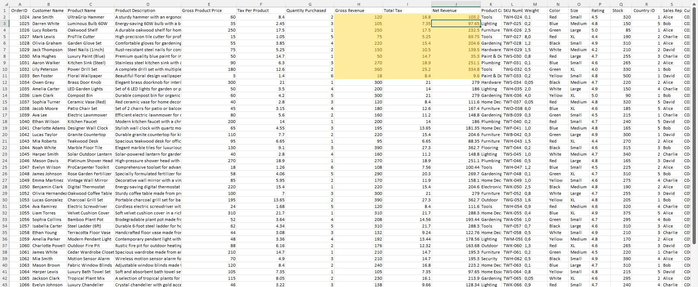
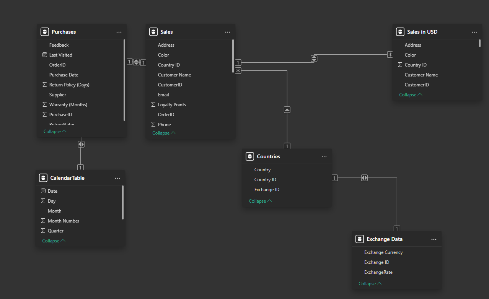
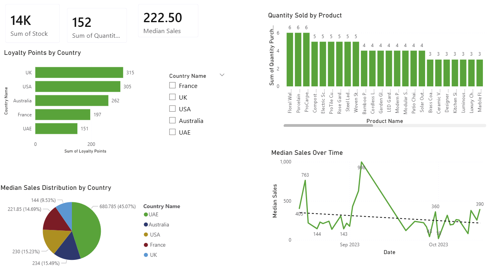
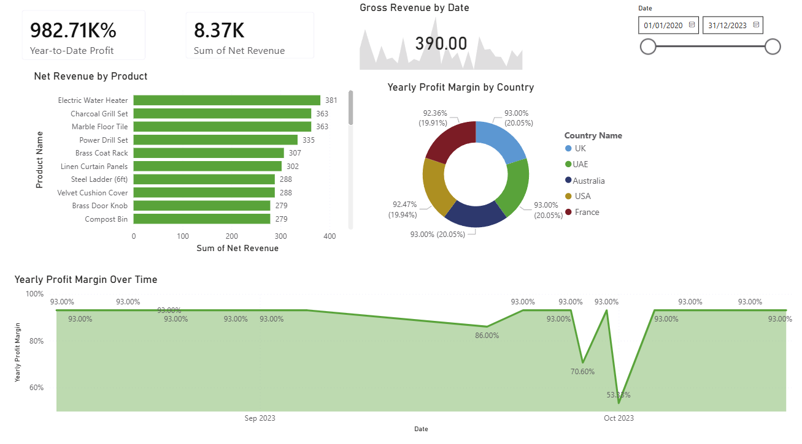
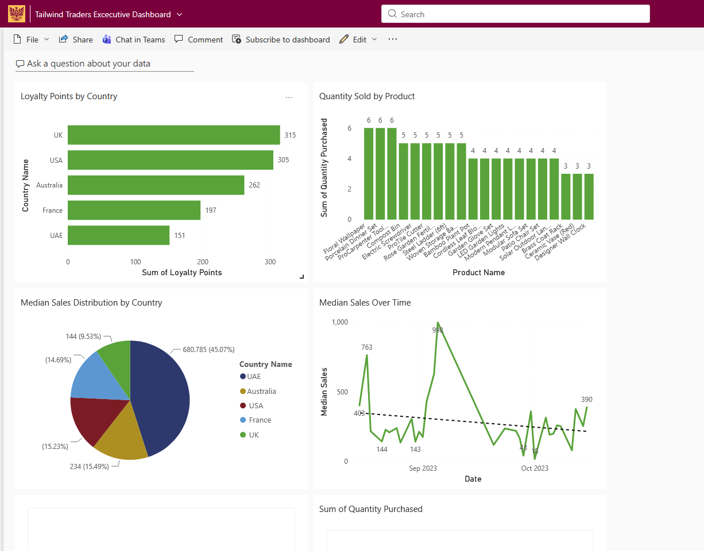
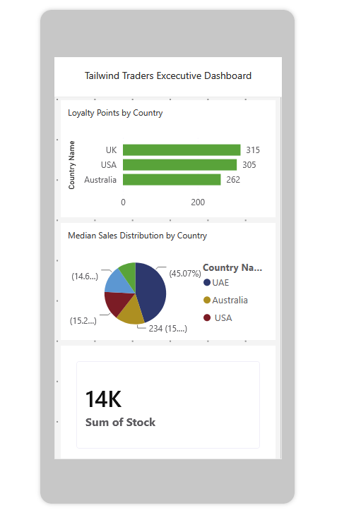

# Microsoft Power BI Capstone Project

## Overview

This project was completed as part of a Microsoft Power BI Capstone project focused on business intelligence reporting, data preparation, data modeling, DAX calculations, dashboard development, and Power BI Service publishing.

The project uses Tailwind Traders sales and purchasing data to build interactive reports and dashboards that help analyze sales performance, revenue trends, product performance, country-level performance, and profitability.

The goal of the project was to create an end-to-end business intelligence solution that prepares raw data, transforms it into a usable reporting model, and presents key insights through interactive Power BI dashboards.

---

## Business Problem

Tailwind Traders needed a reporting solution that could help stakeholders understand the company’s global sales and profit performance.

The solution needed to support:

- Sales data preparation and validation
- Integration of multiple data sources
- Revenue, tax, and net revenue calculations
- Currency conversion into USD
- Product-level and country-level performance analysis
- Time-based sales and profit reporting
- Executive dashboard reporting in Power BI Service
- KPI monitoring workflows

---

## Tools & Technologies

- Microsoft Power BI
- Power Query
- DAX
- Microsoft Excel
- Python
- Power BI Service

---

## Project Workflow

## 1. Excel Data Preparation

The first stage of the project involved preparing the raw sales data in Microsoft Excel before importing it into Power BI.

The sales worksheet was updated with calculated fields for gross revenue, total tax, and net revenue.

### Calculations Created

```excel
Gross Revenue = Gross Product Price * Quantity Purchased
```

```excel
Total Tax = Tax Per Product * Quantity Purchased
```

```excel
Net Revenue = Gross Revenue - Total Tax
```

### Skills Demonstrated

- Excel formula creation
- Revenue calculation
- Tax calculation
- Data preparation
- Business reporting preparation

---

## 2. Power BI Data Source Configuration

After preparing the Excel file, the data was loaded into Power BI and transformed using Power Query.

### Data Sources Used

- Sales data
- Purchases data
- Countries data
- Exchange rate data

### Power Query Tasks Completed

- Imported Excel data into Power BI
- Assigned correct data types to each column
- Validated column quality, distribution, and profile information
- Filtered returned purchases to keep only valid sales records
- Used Python to help transform exchange rate data
- Prepared datasets for modeling and reporting

### Example Data Type Configuration

| Table | Column | Data Type |
|---|---|---|
| Sales | Gross Product Price | Fixed Decimal Number |
| Sales | Tax Per Product | Fixed Decimal Number |
| Sales | Quantity Purchased | Whole Number |
| Sales | Product Category | Text |
| Purchases | Purchase Date | Date |
| Purchases | ReturnStatus | Text |
| Countries | Country | Text |

---

## 3. Data Modeling

A relational data model was created in Power BI to connect sales, purchases, country, exchange rate, and calendar data.

### Tables Included

- Sales
- Purchases
- Countries
- Exchange Data
- CalendarTable
- Sales in USD

### Relationships Created

| Relationship | Field | Cardinality | Cross Filter |
|---|---|---|---|
| Countries → Exchange Data | Exchange ID | One-to-One | Both |
| Sales → Countries | Country ID | Many-to-One | Both |
| Purchases → Sales | OrderID | One-to-One | Both |
| CalendarTable → Purchases | Date / Purchase Date | Many-to-One | Both |
| Sales in USD → Sales | OrderID | Many-to-One | Both |

### Skills Demonstrated

- Data modeling
- Relationship configuration
- Snowflake schema design
- Calendar table setup
- Cross-filtering configuration
- Multi-table reporting structure

---

## 4. DAX Measures and Calculations

DAX was used to create calculated tables and business measures for reporting.

### Calendar Table

A dedicated calendar table was created to support time-based analysis such as yearly, quarterly, monthly, and daily reporting.

### Sales in USD Table

A calculated table was created to convert sales values into USD using exchange rate data.

The table included fields such as:

- Gross Revenue USD
- Net Revenue USD
- Total Tax USD
- Country
- Product
- Date

---

## Key DAX Measures

### Yearly Profit Margin

```DAX
Yearly Profit Margin =
DIVIDE(
    SUM('Sales in USD'[Net Revenue USD]),
    SUM('Sales in USD'[Gross Revenue USD])
)
```

### Quarterly Profit

```DAX
Quarterly Profit =
CALCULATE(
    SUM('Sales in USD'[Net Revenue USD]),
    DATESQTD('CalendarTable'[Date])
)
```

### Year-to-Date Profit

```DAX
Year-to-Date Profit =
TOTALYTD(
    SUM('Sales in USD'[Net Revenue USD]),
    'CalendarTable'[Date]
)
```

### Median Sales

```DAX
Median Sales =
MEDIAN('Sales in USD'[Gross Revenue USD])
```

### Skills Demonstrated

- DAX measure creation
- Time intelligence
- Profit and revenue analysis
- Median calculation
- Calculated table creation
- KPI development

---

## 5. Sales Overview Report

An interactive Sales Overview report page was created to summarize sales performance.

### Visuals Included

- Loyalty Points by Country bar chart
- Quantity Sold by Product column chart
- Median Sales Distribution by Country pie chart
- Median Sales Over Time line chart
- Stock KPI card
- Quantity Purchased KPI card
- Median Sales KPI card
- Country slicer

### Purpose

The Sales Overview report helps users analyze:

- Which countries generated the most loyalty points
- Which products sold the highest quantities
- Median sales distribution across countries
- Sales trends over time
- Overall stock and quantity purchased totals

---

## 6. Profit Overview Report

A second report page was created to focus on profitability and revenue metrics.

### Visuals Included

- Net Revenue by Product bar chart
- Yearly Profit Margin by Country donut chart
- Yearly Profit Margin Over Time area chart
- Year-to-Date Profit KPI card
- Net Revenue KPI card
- Gross Revenue KPI
- Date-based filtering

### Purpose

The Profit Overview report helps users analyze:

- Which products generated the highest net revenue
- Profit margin differences by country
- Profit margin trends over time
- Year-to-date performance
- Gross and net revenue performance

---

## 7. Power BI Service Executive Dashboard

The report was published to Power BI Service and used to create an executive dashboard.

### Dashboard Features

- Pinned sales visuals
- Pinned profit visuals
- Executive KPI cards
- Revenue monitoring
- Country performance views
- Product performance views
- Mobile dashboard layout configuration

### KPI Alert Workflow

The project also explored Power BI Service KPI alert workflows for monitoring revenue performance.

Full alert activation requires a paid Power BI license.

---

## 8. Performance Optimization

Power BI Performance Analyzer was used to review report performance.

### Performance Tasks

- Recorded report visual loading times
- Reviewed DAX query performance
- Checked visual responsiveness
- Identified potential slow-loading visuals
- Validated report efficiency

---

## Screenshots

### Excel Data Preparation



### Power BI Data Model



### Sales Overview Dashboard



### Profit Overview Dashboard



### Executive Dashboard



### Mobile Dashboard Layout



---

## Repository Structure

```text
microsoft-power-bi-capstone-project/
│
├── README.md
├── Tailwind_Traders_Report.pbix
├── Tailwind_Traders_Sales.xlsx
│
└── screenshots/
    ├── excel-prepared-data.png
    ├── data-model.png
    ├── sales-overview.png
    ├── profit-overview.png
    ├── executive-dashboard.png
    └── executive-dashboard-mobile.png
```

---

## Skills Demonstrated

- Business Intelligence Reporting
- Data Analysis
- Data Cleaning
- Data Transformation
- Data Validation
- Power BI Dashboard Development
- Power Query
- DAX
- Excel Analytics
- Data Modeling
- Relationship Design
- KPI Reporting
- Data Visualization
- Time Intelligence
- Power BI Service Publishing
- Executive Dashboard Design
- Performance Analyzer Review

---

## Files Included

| File | Description |
|---|---|
| `Tailwind_Traders_Report.pbix` | Final Power BI report file containing the data model, DAX measures, and report pages |
| `Tailwind_Traders_Sales.xlsx` | Prepared Excel sales dataset used in the project |
| `screenshots/` | Folder containing project screenshots for documentation |
| `README.md` | Project documentation |

